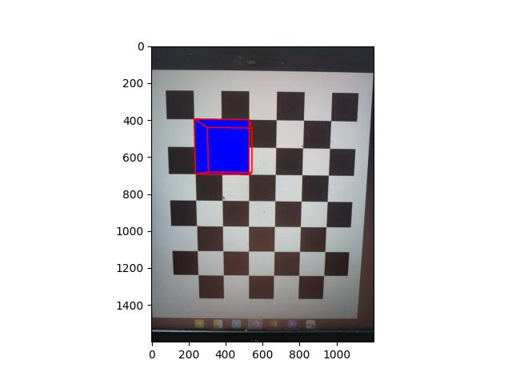
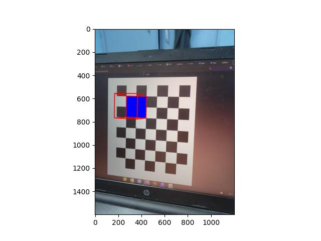
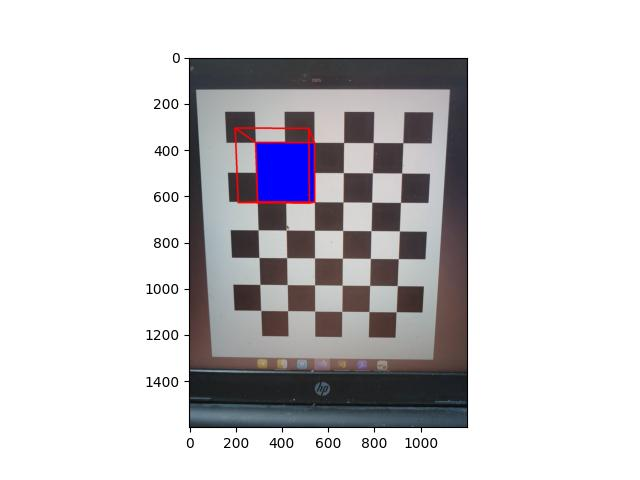
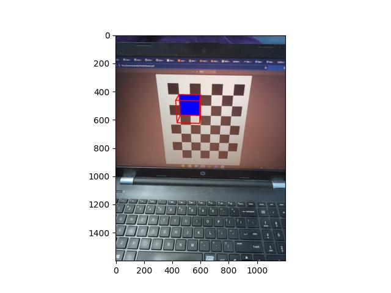
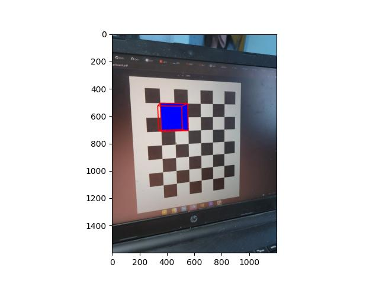

# Assignment 3
## Submission By: Zuhaib Ul Zamann
# Part 1:
File: DLT.py<br>
Class: DirectLinearTransform<br>
Methods:
- __normalize2d__: Normalizes the points to set their mean to 0 and standard deviation to $\sqrt{2}$
- __DLT__: Direct linear transform, least squares solution of $\lVert Ax\rVert$ subject to $\lVert x \rVert = 1$

File: CheckerBoardPoints.py
Fields: 
- __CHECKERBOARD_SIZE__: The size of the checker board in the image for callibration<br>

Methods: 
- FindPoints: Returns the world coordinates and the image coordinates of reference points of a checkerboard 

File: CameraHomography.py<br>
Fields: <br>
- __checkerBoard__: ``CheckerBoardPoints`` Object to get the mappings between image points and world coordinate points
- __DLT__: DirectLinearTransform object to solve least squares problem for finiding homography

Methods
- __createMatrix__: Normalizes images coordinates and world coordinates. and then forms matrix A of the system of equation for finding homography matrix H. For references: https://www.ipb.uni-bonn.de/html/teaching/photo12-2021/2021-pho1-22-Zhang-calibration.pptx.pdf
```math
A = \begin{bmatrix}A_1\\ A_2\\ A_3\\ \vdots \\ A_n \end{bmatrix}
```
```math
A_i =\begin{bmatrix}
-X_i& -Y_i& -1& 0& 0& 0& x_iX_i&x_iY_i& x_i\\
0& 0 & 0 & -X_i & -Y_i & -1 & y_iX_i & y_iY_i & y_i
\end{bmatrix}
```
- __getHomography__: Takes input as the checkerboard image and outputs the camera homography matrix. This solves the system of equation $$Ah = 0$$ where A is as described in createMatrix function above.

File: Zhang.py<br>
Class: CallibrateCamera<br>
Fields: <br>
- __DLT__: DirectLinear transform object for solving least squares problem for finding the intrinsic matrix
- __homographies__: List of homographies obtained from the images in the ``folder``
- __cam__: CameraHomography object for finding the homographies

Methods:
- __createVector__: Vector for forming orthonormality constraints of rows of Rotation matrix
```math
V_{ij} = \begin{bmatrix}
h_{1i}h_{1j} \\ h_{1i}h_{2j} + h_{2i}h_{1j}\\ h_{3i}h_{1j} + h_{1i}h_{3j}\\ h_{2i}h_{2j}\\ h_{3i}h_{2j} + h_{2i}h_{3j}\\h_{3i}h_{3j}
\end{bmatrix}
```
We obtain two equation from one homography matrix viz
```math
\displaystyle V_{12}^Tb = 0 \text{ and }\displaystyle (V_{11}^T - V_{22}^T)b =0
```

- __createMatrix__: Form matrix of equations given the list of homographies

- __getBMatrix__: Least squares solution of the above equations formed
- __getKMatrix__: Cholesky decomposition of BMatrix to get Kmatrix. Solution provided in appendix of paper by Zhang, https://www.researchgate.net/publication/3193178_A_Flexible_New_Technique_for_Camera_Calibration.
- __reorthogonalize__: Correct a matrix A to get the matrix R which is a rotation matrix is is least distant in terms of frobeniums norm from A.<br>
In short the solution of the optimization problem 
$$\min_{R^TR = I} \lVert A - R\rVert _F$$
- __getExtrinsics__: Given homography matrix H and intrinsic params K, get the Extrinsic parameter matrix $[R|t]$<br>
Solution follows from the observation that $h_1 = Kr_1$  and $h_2 = Kr_2$ and  $r_3 = r_1 \times r_2$ .<br>
Reorthogonalize is used to correct the rotation matrix obtained.
Finally $t$ is obtained from the observation that $h_3 = Kt$

- __FindAllExtrinsics__: Calculate the extrinsics matrix of all the homographies obtained

# Part 2:
The extrinsic and intrinsic parameters obtained are used to project the corners of the cube $$[0, 0, 0], [0, 3, 0], [3,0, 0], [3, 3, 0], [0, 0, 3], [0, 3, 3], [3, 0, 3], [3, 3,3]$$ onto the image.<br>
This forms an augmented image in which a cube is placed on the checkerboard<br>

__Results__ <br>
Augmented Images generated<br>
- 
- 
- 
- 
- 

Intrinsic Matrix obtained
```math
\begin{bmatrix}
1.23980967e+03 & 7.04909301e-02 & 6.21308602e+02\\
 0.00000000e+00 & 1.24114175e+03 & 7.94609826e+02\\
 0.00000000e+00 & 0.00000000e+00 & 1.00000000e+00
\end{bmatrix}
```
